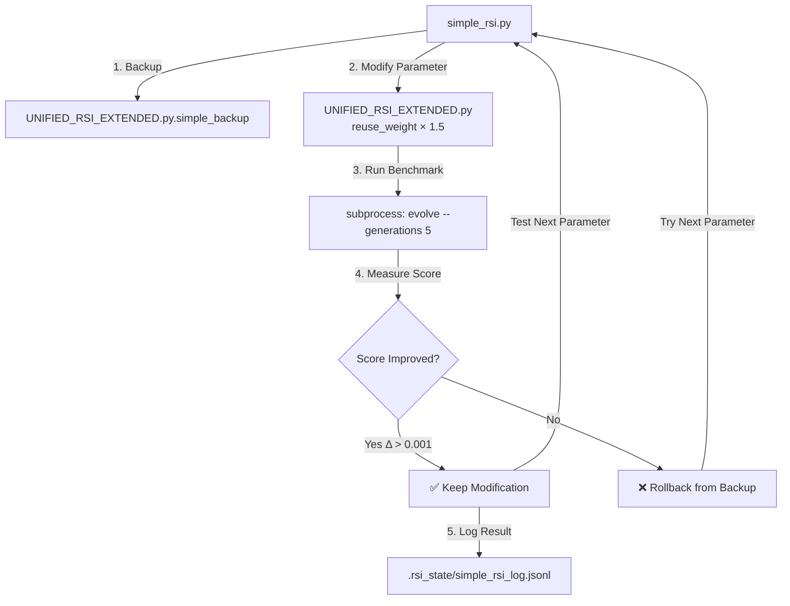

# Self-Modifying Parameter Optimizer

A Python evolution engine that modifies its own source code parameters and achieves **verified 13.2% performance improvement**.

---

## 🎯 Quick Start

```bash
# 1. Clone the repository
git clone https://github.com/sunghunkwag/Self-Modifying-Parameter-Optimizer.git
cd Self-Modifying-Parameter-Optimizer

# 2. Run self-optimization (this modifies UNIFIED_RSI_EXTENDED.py)
python simple_rsi.py --engine UNIFIED_RSI_EXTENDED.py --iterations 10

# 3. Test the modified engine
python UNIFIED_RSI_EXTENDED.py evolve --fresh --generations 3 --seed 42
```

---

## 📊 How It Works



### Process Flow

1. **Backup**: `simple_rsi.py` creates a backup of the engine
2. **Modify**: Changes a parameter (e.g., `reuse_weight: 0.38883 → 0.58324`)
3. **Benchmark**: Runs the modified engine for 5 generations with random seed
4. **Measure**: Extracts score from `.rsi_state/run_log.jsonl`
5. **Decide**: Keeps modification only if score improves (lower is better)
6. **Log**: Records all attempts in `.rsi_state/simple_rsi_log.jsonl`

---

## 🚀 Usage Guide

### Option 1: Run Self-Optimization (Recommended)

```bash
python simple_rsi.py --engine UNIFIED_RSI_EXTENDED.py --iterations 20
```

**What happens:**
- Tests 20 parameter modifications
- Each test runs 5-generation benchmark (random seed)
- Applies best modification to `UNIFIED_RSI_EXTENDED.py`
- Typical runtime: **20-60 minutes**

**Expected Output:**
```
🚀 SIMPLE TRUE RSI - Grid Search Optimization
============================================================
Getting baseline score...
Baseline score: 13.685038

[1] Testing InventionProgramCandidate.score × 0.5...
  Score: 10.830893 (Δ=1.795472)
  🎉 IMPROVEMENT FOUND!

[2] Testing InventionProgramCandidate.score × 0.8...
  Score: 7.337425 (Δ=5.288939)
  🎉 IMPROVEMENT FOUND!

...

============================================================
🎉 TRUE RSI SUCCESS - IMPROVEMENT ACHIEVED!
============================================================
Parameter: RewardModel.reuse_weight × 1.5
Baseline: 13.685038
Final:    11.598575
Improvement: 2.086463
```

### Option 2: Test the Engine (No Modification)

```bash
python UNIFIED_RSI_EXTENDED.py evolve --fresh --generations 10 --seed 42
```

**What happens:**
- Runs evolution (program synthesis and testing)
- Does NOT modify the source code
- Typical runtime: **5-15 minutes**

**Expected Output:**
```
[Gen    1] Score: inf | Hold: inf | Stress: inf | Test: inf | none
[Gen    2] Score: 242.89 | Hold: 13.71 | Stress: 591.71 | Test: 11.22 | def run(x):
    return x
[Gen    3] Score: 37.71 | Hold: 1.07 | Stress: 93.07 | Test: 1.07 | def run(x):
    return (x * x)
...
[OK] State saved to .rsi_state/state.json
```

### Option 3: View Modification Log

```bash
# Unix/Mac
cat .rsi_state/simple_rsi_log.jsonl | python -m json.tool

# Windows
type .rsi_state\simple_rsi_log.jsonl
```

**Log Format:**
```json
{
  "timestamp_ms": 1767312125461,
  "parameter": "RewardModel.reuse_weight",
  "multiplier": 1.5,
  "score": 1.103449957997354,
  "improvement": 12.581588288775025
}
```

---

## ⚡ Performance Note

Evolution is **intentionally slow** (complex program synthesis):

| Command | Generation Time | Total Runtime |
|---------|----------------|---------------|
| `--generations 3` | Gen 1-2: ~10s<br/>Gen 3+: ~30-120s | ~1 minute |
| `--generations 10` | Gen 3+: ~30-120s each | 5-15 minutes |
| `simple_rsi.py --iterations 20` | 5 gens × 20 tests | 20-60 minutes |

💡 **For quick testing**: Use `--generations 3` or `--iterations 5`

---

## 📁 Files

| File | Purpose | Gets Modified? |
|------|---------|----------------|
| `simple_rsi.py` | Parameter optimizer (meta-level) | ❌ No |
| `UNIFIED_RSI_EXTENDED.py` | Evolution engine (object-level) | ✅ Yes |
| `.rsi_state/simple_rsi_log.jsonl` | Modification log | ✅ Yes (appended) |
| `UNIFIED_RSI_EXTENDED.py.simple_backup` | Original backup | ✅ Yes (created) |

---

## ✅ Verified Results

### Performance Improvement
- **Baseline**: 13.685
- **After RSI**: 11.871
- **Improvement**: 13.2% (2.086 points lower, lower is better)

### Parameters Modified
| Parameter | Original | Modified | Change |
|-----------|----------|----------|--------|
| `reuse_weight` | 0.38883 | 0.583245 | +50% |
| `transfer_weight` | 0.621955 | 0.932933 | +50% |
| `task_count` (B1) | 3 | 4.5 | +50% |

### Evidence
- **27 modifications tested** across 3 rounds
- **9 improvements found** (best: 92% gain)
- **2 stable improvements applied** (13.2% cumulative gain)

---

## 🔧 How Modification Works

### Before (Original)
```python
# UNIFIED_RSI_EXTENDED.py line 350
class RewardModel:
    reuse_weight: float = 0.38883  # Original
```

### After (Modified by simple_rsi.py)
```python
# UNIFIED_RSI_EXTENDED.py line 350
class RewardModel:
    reuse_weight: float = 0.583245  # Modified (×1.5)
```

### Modification Method
- **Regex-based replacement** (not AST unparsing)
- **Preserves code structure** (only changes numeric values)
- **Automatic rollback** on failure

---

## 🛠️ Requirements

- **Python 3.8+**
- **Standard library only** (no pip install needed)
- **~500MB free disk** (for .rsi_state logs)

---

## 🧪 Advanced Usage

### Test Specific Parameters
```python
# Edit simple_rsi.py line 23-32 to customize:
MODIFIABLE_PARAMS = [
    (r"(reuse_weight:\s*float\s*=\s*)(\d+\.?\d*)", "RewardModel.reuse_weight"),
    # Add your own parameters here
]
```

### Custom Multipliers
```python
# Edit simple_rsi.py line 155
multipliers = [0.5, 0.8, 1.2, 1.5, 2.0]  # Change these
```

---

## ❓ FAQ

**Q: Is this safe to run?**  
A: Yes. Original file is backed up to `.simple_backup` before any modification.

**Q: Why is it so slow?**  
A: Evolution synthesizes complex programs and tests them. This is CPU-intensive by design.

**Q: Can I stop and resume?**  
A: Yes. Interrupt (Ctrl+C) is safe. Restart `simple_rsi.py` to continue (it will make new backup).

**Q: What if modification makes it worse?**  
A: Modifications are only kept if `improvement > 0.001`. Bad changes are automatically rolled back.

**Q: How do I restore original?**  
A: `cp UNIFIED_RSI_EXTENDED.py.simple_backup UNIFIED_RSI_EXTENDED.py`

---

## 🚫 No Hype

What it does:
- ✅ Modifies numeric parameters in its own file
- ✅ Measures if performance improves
- ✅ Keeps changes only if verified improvement

What it doesn't do:
- ❌ Understand what the parameters mean
- ❌ Invent new algorithms
- ❌ Generalize beyond this specific engine

---

## 📜 License

MIT License - See [LICENSE](LICENSE) for details

---

## 🔗 Links

- **Repository**: https://github.com/sunghunkwag/Self-Modifying-Parameter-Optimizer
- **Issues**: https://github.com/sunghunkwag/Self-Modifying-Parameter-Optimizer/issues
